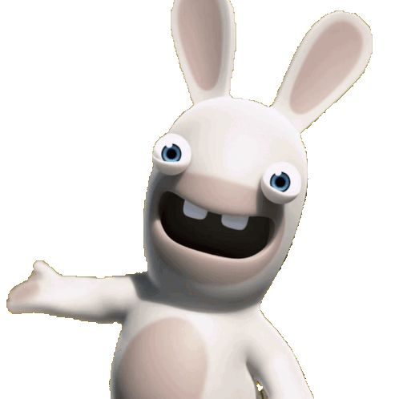

<h2>Olá, sou o Daim0nd! 👋</h2>

<h3>👨🏻‍💻 &nbsp;Sobre mim</h3>

  💡 &nbsp;Gosto de explorar e aprender novas tecnologias. 
  🎓 &nbsp;Estou no ensino médio e quero iniciar minha carreira em desenvolvimento de software. 
  🌱 &nbsp;Busco criar plugins para diversos tipos de servidores de Minecraft. 
  ✍️ &nbsp;Meus hobbies são treinar, desenvolver plugins e explorar novas áreas. 
  💬 &nbsp;Sinta-se à vontade para entrar em contato comigo!

<h3>🛠 &nbsp;Tech Stack</h3>

  &nbsp;
  &nbsp;
  &nbsp;
  &nbsp;
   
  &nbsp;
  &nbsp;
  &nbsp;
  &nbsp;
  &nbsp;
  

 

<h3>⚙️ &nbsp;Estatísticas do GitHub</h3>

  

<h3>🤝🏻 &nbsp;Entre em contato</h3>

  

