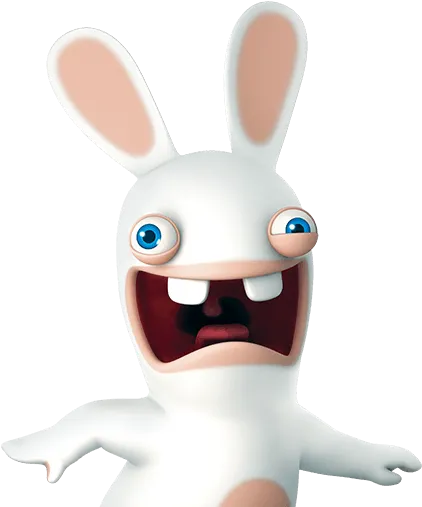

## Sobre mim

Meu nome é Daymon, tenho 16 anos e sou estudante do ensino médio, meu hobby é desenvolver plugins para servidores. Busco aprimorar minhas habilidades de programação por meio de projetos práticos.

### Tecnologias e  Ferramentas: 

  
  
  
  

 